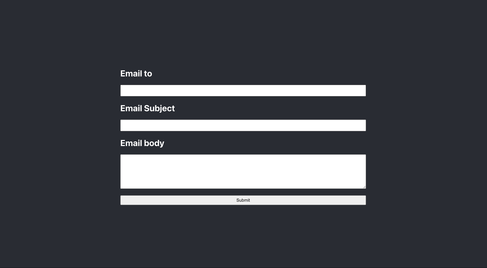

# Bringx_assignment2

## Live Link

https://bringx-email.onrender.com/

## Description

This is a website testing for sending email from backend. Build with React/Express. Also can use Postman or any API testing side to testing the email.

## API Testing Method

```
 POST https://bringx-email-server.onrender.com/emails

with JSON body:
{
  to: "myemail@example.com",
  subject: "hi",
  body: "Hello World!"
}

```

You will got the email from me!
(Please check your spam box if you don't get it!!!)

## Usage



## Table of Contents

- [Description](#description)
- [API Testing Method](#api-testing-method)
- [Installation](#installation)
- [Usage](#usage)
- [Built_With](#built-with)
- [API_Resources](#api-resources)
- [License](#license)

## Installation

```
 git clone https://github.com/ollyhite/Bringx_assignment2.git
```

- create a file
- open ternimal and cd the file name you created
- git clone with my repo link (can copy Installation section's first line)
- cd in the Bringx_assignment2 file
- install the node_module in client and server side

```
    npm run install
```

- next run start:dev to open the website

```
    npm run start:dev
```

## Built With

- React.js
- Express
- Render

## API Resources

- @sendgrid/mail

## Author Info & Getting Help

- [Pei-Yun Hite's LinkedIn](https://www.linkedin.com/in/peiyunhite/)
- [Pei-Yun Hite's Github Link](https://github.com/ollyhite)
- [Pei-Yun Hite's Portfolio](https://www.peiyunhite.com/)
- Send Qquestions or suggestions for changes to the readme_generator_tool project maintainer, [Pei-Yun Hite](mailto:peiyunhite@gmail.com?subject=[GitHub]%20employee_organizer%20) , for consideration.

## License

MIT License
Copyright (c) 2023 Pei-Yun Hite
Permission is hereby granted, free of charge, to any person obtaining a copy of this software and associated documentation files (the "Software"), to deal in the Software without restriction, including without limitation the rights to use, copy, modify, merge, publish, distribute, sublicense, and/or sell copies of the Software, and to permit persons to whom the Software is furnished to do so, subject to the following conditions:
The above copyright notice and this permission notice shall be included in all copies or substantial portions of the Software.
THE SOFTWARE IS PROVIDED "AS IS", WITHOUT WARRANTY OF ANY KIND, EXPRESS OR IMPLIED, INCLUDING BUT NOT LIMITED TO THE WARRANTIES OF MERCHANTABILITY, FITNESS FOR A PARTICULAR PURPOSE AND NONINFRINGEMENT. IN NO EVENT SHALL THE AUTHORS OR COPYRIGHT HOLDERS BE LIABLE FOR ANY CLAIM, DAMAGES OR OTHER LIABILITY, WHETHER IN AN ACTION OF CONTRACT, TORT OR OTHERWISE, ARISING FROM, OUT OF OR IN CONNECTION WITH THE SOFTWARE OR THE USE OR OTHER DEALINGS IN THE SOFTWARE.

[https://choosealicense.com/licenses/mit/](https://choosealicense.com/licenses/mit/)
